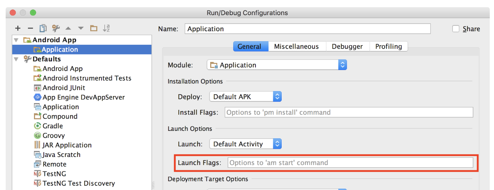
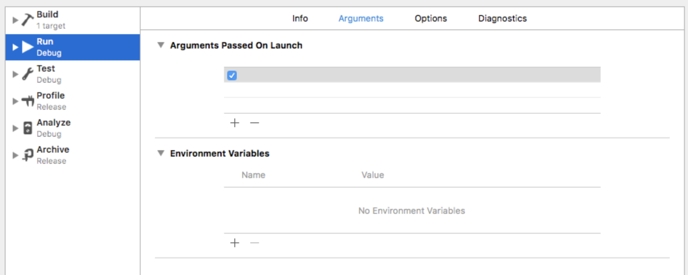

## `ern start`

#### Description

* Create a composite bundle out of multiple MiniApps and start the react-native local packager to serve this bundle so that it can be loaded within the native host application  

#### Syntax

`ern start`  

**Note**

If you do not pass an argument to this command, you are prompted to select a native application version from the Cauldron. The command uses whatever MiniApp versions are curently declared in this native application version container to launch the command.  

**Options**  

`--baseComposite <compositePath>`

* Git or File System path, to the custom Composite repository (refer to the [custom Composite] documentation for more information).

`--compositeDir <compositeDir>`

* Directory in which to generate the composite
* The directory should either not exist (will be created) or be empty
* By default the composite will be generated in a temorary directory

`--descriptor/-d <descriptor>`

* Target a specific native application version, associated to the provided *complete native application descriptor*.  
* This option uses whatever MiniApp versions are currently declared in this native application version container to launch the command.  

`--miniapps/-m <miniapps>`

* Specify one or more MiniApps to launch this command  
* The command packages all the provided MiniApps in a composite bundle and starts the react-native packager.  
* You can use any valid Yarn package descriptor for the MiniApps provided to this command, including Git and other file system path schemes.  

`--jsApiImpls`

* Specify one or more JS API Implementations to include

`--watchNodeModules/-w <nodemodules>`
* A list of one or more directory name(s) from node_modules that should be watched for changes.

`--extraJsDependencies/-e <jsdependencies>`
* Additional JavaScript dependencies to add to the composite JavaScript bundle.

`--host`
* Host or ip to launch the local packager on *(default: localhost)*

`--port`
* Port on which the local packager should listen on *(default: 8081)*

`--resetCache`\

* Indicates whether to reset the React Native cache prior to bundling

**Platform Specific Options**

`Android`

`--activityName/-a <activity name>`
* Specify Android Activity to launch.

`--launchFlags <string>`
* Extra options passed to `am start` command when launching the application (correspond to the `Launch Flags` in Run/Debug Configurations of application in Android Studio, as can be seen on screenshot below)
* Make sure to use `=` on the command line to provide this option, and keep the string in quotes. For example `--launchFlags="--es aKey aStringValue --ei anotherKey 1"`

`--packageName/-p <packagename>`
* Android application package name to avoid conflict with the names of classes or interfaces.

`iOS`

`--bundleId/-b`
* iOS Bundle Identifier unique to your app.

`--launchArgs` 
* Arguments to pass to the application when launching it (correspond to the `Arguments Passed On Launch` in application scheme run config in XCode as can be seen on screenshot below).
* Make sure to use `=` on the command line to provide this option, and keep the string in quotes. For example `--launchArgs="-ArgA -ArgB"`

`--launchEnvVars`
* Environment variables to pass to the application when launching it (correspond to the `Environment Variables` in application scheme run config in XCode as can be seen on screenshot below).
* Make sure to use `=` on the command line to provide this option, and keep the string in quotes. The string should contain `key=value` pairs delimited by spaces. For example `--launchEnvVars="aKey=aValue anotherKey=anotherValue"`

* **Default** false

**Binary Store Specific Options**

`--disableBinaryStore`

* Setting this option will bypass retrieval and installation of the binary from the Binary Store.  
* It can be useful in case you want to use `ern start` command in conjunction with your own mobile application native binary, build locally on your workstation or retrieved from a specific location.

`--flavor`

* Flavor of the binary to retrieve from the store.
* The binary of a specific application version (for ex `1.0.0`) can have different flavors, representing different build types of the same application version (for example `Dev`/`Prod`/`QA` ...).

#### Remarks

* This command can be used to package multiple MiniApps inside a single composite bundle and automatically start the react-native local packager to serve this bundle.  
* Use this command when you need to launch and develop or debug your MiniApps from within a native host application which contains other MiniApps along with your MiniApp.  
* This command works with the `ern link` command. For additional information, see the documentation for the `ern link` command.  
* When using a binary store, file watcher will be started after the binary is retrieved and installed on the simulator/device. If you are using a binary store and don't want to launch binary from the store, please make sure to use the `--disableBinaryStore` option. Otherwise, file watcher will not be started.

#### Related commands

 [ern link] | Link to a MiniApp directory

[ern link]: ./link.md
[custom Composite]: ./platform-parts/composite/index.md
